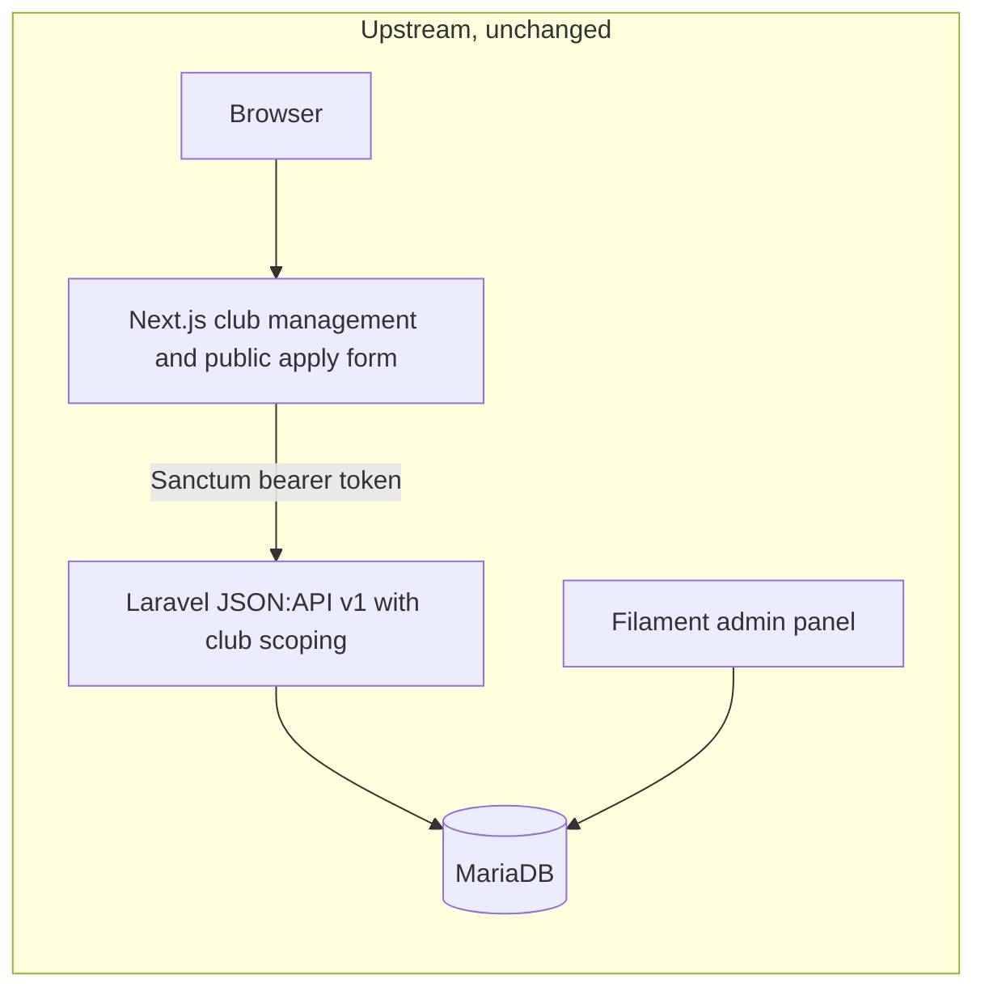
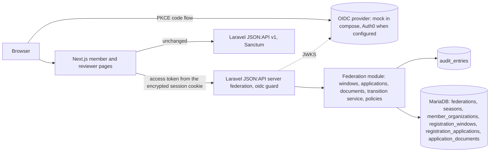

# Federation Member Services Lab

[](https://github.com/nick-bellows/federation-member-services-lab/actions/workflows/ci.yml)

An engineering modernization lab: an existing open-source club-management platform, extended step by step into a member-services system for a fictional national soccer federation, without a rewrite.

> **Fork notice.** This repository is a fork of [vereinfacht/vereinfacht](https://github.com/vereinfacht/vereinfacht) (MIT, © visuellverstehen GmbH). Upstream's history, license and attribution are preserved; upstream's own README is kept verbatim at [`docs/UPSTREAM_README.md`](docs/UPSTREAM_README.md). Everything the fork added is listed below and is visible with `git log upstream/main..main` and `git diff --stat upstream/main`.
>
> **Status: `validated` in CI, not deployed.** Everything described here runs in the local Docker Compose stack and in the CI workflow on GitHub (nine jobs on every push and pull request; badge above). Nothing is deployed and nothing here has users. The federation, its organizations and every person in the seed data are invented; this project is not affiliated with, endorsed by, or based on the internal systems of any real federation.

## The problem this fork works on

A national federation inherits a club-management platform that hundreds of clubs already use for membership applications, member records and club finances. The federation needs registration above the club level: organizations that group clubs, seasons, people who sign in with an identity the federation does not store passwords for, applications that move through review with reasons and an audit trail, and eligibility that is derived from facts rather than typed into a checkbox. A rewrite would break the clubs. The question the repository answers, milestone by milestone, is **how to add all of that to a running system without destabilizing what already works**.

The sibling project [learning-center-reference](https://github.com/nick-bellows/learning-center-reference) owns education, certification and safeguarding-derived eligibility. This repository owns organizations, membership, registration applications, document review and audit, and consumes credentials from the Learning Center over an HTTP contract only. The two never share a database.

## What the fork added, in order

| Milestone | What exists | Evidence |
|---|---|---|
| M0 Archaeology | The upstream system running unchanged; its request path, tests and gaps catalogued | [`docs/UPSTREAM_ANALYSIS.md`](docs/UPSTREAM_ANALYSIS.md) |
| M1 Baseline quality | One `env()` fix with a fail-then-pass test, line-ending safety, the CI workflow | [ADR-0002](docs/adr/0002-runtime-settings-through-config-not-env.md) |
| M2 Federation domain | A hierarchy above the clubs; a seven-state lifecycle, one writer; an audit trail | [ADR-0006](docs/adr/0006-application-state-machine-and-audit-trail.md) |
| M3 Identity | OIDC sign-in, token kept server-side; capabilities from the database, never from claims | [ADR-0007](docs/adr/0007-oidc-identity-boundary.md) |
| M4 Review slice | Applications with document metadata, idempotent submission, member and reviewer pages | [ADR-0008](docs/adr/0008-document-metadata-without-file-storage.md) |
| M5 Learning Center contract | A credentials contract with fixtures; participation derived from a snapshot | [ADR-0009](docs/adr/0009-learning-center-credentials-contract.md) |
| M6 Events and reliability | A transactional outbox, a worker, a processed-events ledger, retries, a parked state | [ADR-0010](docs/adr/0010-transactional-outbox-and-consumers.md) |
| M7 PostgreSQL | A three-engine CI matrix; upstream's MySQL-only SQL made portable with a regression test | [ADR-0011](docs/adr/0011-postgresql-compatibility-matrix.md) |
| M8 Operability | JSON logs, traces to Jaeger, liveness, readiness and metrics, a runbook proved against the incidents | [`docs/OBSERVABILITY.md`](docs/OBSERVABILITY.md) |
| M9 Accessibility and performance | A manual WCAG 2.1 AA review; five indexes and an eager-loaded listing measured before and after | [`docs/PERFORMANCE.md`](docs/PERFORMANCE.md) |
| B7 Security review | Six attack trees; JSON Patch with field-level authorization; operator endpoints behind a token | [`docs/THREAT_MODEL.md`](docs/THREAT_MODEL.md) |
| M10 Release engineering | Release images, a one-off migration task, worker and scheduler as services, a design not provisioned | [`docs/DEPLOYMENT.md`](docs/DEPLOYMENT.md) |
| M11 Case study and demo | The case study, a recorded demo, the deferred accessibility fixes, the upstream offer drafted, not sent | [`docs/CASE_STUDY.md`](docs/CASE_STUDY.md) |
| Phase C Closing (2026-09-10) | Four reviewed defects fixed with fail-then-pass tests; a secret-scan gate | [ADR-0016](docs/adr/0016-boundary-rules-from-the-external-reviews.md) |
| Closing review (2026-09-12) | Four independent reviews; each finding fixed with a regression test; every Action pinned | [`docs/THREAT_MODEL.md`](docs/THREAT_MODEL.md) (2.9) |

Full milestone detail with every retained run: [`docs/MILESTONES.md`](docs/MILESTONES.md)

Not done, by design: the application is not deployed (the architecture is designed, and a minimal Terraform proof of it is validated and priced, not applied); the documentation site is, at [nick-bellows.github.io/federation-member-services-lab](https://nick-bellows.github.io/federation-member-services-lab/). Nothing has been offered upstream (one offer is drafted and waits for the owner's word); the Auth0 walkthrough waits for a tenant. The order and gates are in [`ROADMAP.md`](ROADMAP.md).

## Architecture

**Inherited.** A Laravel 13 JSON:API backend with a Filament admin panel and Sanctum tokens, a Next.js 14 frontend, MariaDB, Docker Compose for development.



**Added.** A second JSON:API server for the federation, an OIDC identity boundary, the domain module, and a mock identity provider for development and CI. Upstream's paths are untouched; the two additive columns on upstream tables are nullable.



Decisions behind every box are recorded in [`docs/adr/`](docs/adr/).

## Five-minute path for a reviewer

| Minute | Open | What it shows |
|---|---|---|
| 0–1 | This page, then [`docs/UPSTREAM_ANALYSIS.md` §8](docs/UPSTREAM_ANALYSIS.md) | What was inherited, what was wrong with it, what the fork changed |
| 1–2 | The diagrams above, [`docs/DOMAIN_MODEL.md`](docs/DOMAIN_MODEL.md) | Identity, membership hierarchy, application lifecycle, audit |
| 2–3 | [`api/app/Federation/StateMachine/ApplicationTransitions.php`](api/app/Federation/StateMachine/ApplicationTransitions.php) and [`api/app/Federation/Actions/TransitionApplication.php`](api/app/Federation/Actions/TransitionApplication.php) | The one place status changes: legality, actor, reason, completeness, idempotency, audit, after-commit event |
| 3–4 | [`api/tests/Unit/Federation/ApplicationTransitionsTest.php`](api/tests/Unit/Federation/ApplicationTransitionsTest.php), [`api/tests/Feature/Federation/Http/RegistrationApplicationsHttpTest.php`](api/tests/Feature/Federation/Http/RegistrationApplicationsHttpTest.php), [`api/tests/Feature/Federation/OidcTokenVerifierTest.php`](api/tests/Feature/Federation/OidcTokenVerifierTest.php) | All 49 transition pairs pinned; authorization, idempotency and failure handling over HTTP; signature, issuer, audience, expiry, key rotation |
| 4–5 | [INCIDENT-000](docs/incidents/INCIDENT-000-dev-database-wiped-by-config-cache.md), [ADR-0007](docs/adr/0007-oidc-identity-boundary.md), [ADR-0004](docs/adr/0004-upstream-contribution-policy.md) | A real incident with a permanent fix; a boundary decision; what will be offered upstream and how |

## Screenshots

Captured from the running stack by [`e2e/tests/screenshots.spec.ts`](e2e/tests/screenshots.spec.ts); every name and file is synthetic.

| | |
|---|---|
|  |  |
|  |  |

## Running it locally

Requirements: Docker Desktop (or Docker Engine with Compose v2) and Node 20+ on the host only for the browser tests. No PHP is needed on the host; everything PHP runs in the `tooling` container, as upstream intends.

```sh
git clone --config core.autocrlf=false https://github.com/nick-bellows/federation-member-services-lab.git   # autocrlf off keeps the container scripts LF on Windows
cd federation-member-services-lab
git remote add upstream https://github.com/vereinfacht/vereinfacht.git && git fetch upstream   # only for the upstream-versus-fork diff above
cp docker-compose.override.example.yml docker-compose.override.yml   # Windows/NTFS: dependency trees in named volumes
printf 'USER_ID=1000\nGROUP_ID=1000\n' > .env
docker compose up -d --build database api api-docs oidc learning-center jaeger tooling
docker compose exec tooling bash
```

Inside the container:

```sh
cd api
composer install
cp .env.example .env && php artisan key:generate
sed -i 's/^MAIL_MAILER=smtp/MAIL_MAILER=log/' .env          # no mailpit service in compose
# The api container migrates the empty database on its own first start. Wait until
# `docker compose logs api` shows "Starting the app" (several minutes), then:
php artisan migrate:fresh --seeder=NorthgateDemoSeeder      # upstream's fake clubs + the Northgate federation
php artisan federation:reconcile-credentials --all         # credential snapshots from the Learning Center mock for approved applicants
php artisan filament:assets && npm ci && npm run build
cd ../web_application
cp .env.local.example .env.local
npm ci
WATCHPACK_POLLING=true npx next dev                          # polling: bind mounts on Windows deliver no file events
```

Then restart the API once so it loads the environment: `docker compose restart api`, and start the outbox relay and queue worker in the API container as its PHP-FPM user: `docker compose exec -d -u verein api php artisan federation:work` (ADR-0010; `php artisan federation:outbox-status` shows what it has done).

| Where | What |
|---|---|
| http://localhost:3000/en/member/sign-in | Member sign-in through the mock OIDC provider. Type any subject and a claims JSON such as `{"email":"alex.participant@northgate.example","email_verified":true,"name":"Alex Participant"}`. Seeded people: `alex.participant`, `sam.coach`, `riley.referee`, `jordan.newcomer`, `nysa-admin`, `nasl-admin`, `nra-admin`, `federation-admin`, all `@northgate.example`. Administrators see the review queue and the windows page. |
| http://localhost:3001/admin | Upstream's Filament panel, unchanged (`hello@vereinfacht.digital` / `password`) |
| http://localhost:3000/de/admin/auth/login | Upstream's club management, unchanged (`club-admin-1@example.org` / `password`; needs the super-admin token step from [`docs/UPSTREAM_README.md`](docs/UPSTREAM_README.md)) |
| http://localhost:3001/federation_openapi.json | The federation API contract |
| http://localhost:3004/default/.well-known/openid-configuration | The mock identity provider |
| http://localhost:3005/health | The Learning Center credentials mock; it serves the contract fixtures and takes `LEARNING_CENTER_MOCK_DELAY_MS` for the Incident 1 rehearsal |
| http://localhost:3006 | Jaeger: traces from the API, the outbox worker and the Learning Center call (service `federation-api`) |
| http://localhost:3001/api/health/ready, /api/metrics | Readiness with per-dependency detail; the federation's numbers in Prometheus text format ([`docs/OBSERVABILITY.md`](docs/OBSERVABILITY.md)) |

Every deviation from upstream's own instructions, and why, is in [`docs/UPSTREAM_ANALYSIS.md` §11](docs/UPSTREAM_ANALYSIS.md).

## Tests

```sh
docker compose exec tooling bash -lc 'cd api && php artisan test'          # 247 tests, SQLite in memory
cd e2e && npm ci && npx playwright install chromium && npx playwright test   # the browser journeys with axe against the running stack: 9 run in CI, 4 skipped by design (the screenshots, the demo recording, a slow-connection timing check, the Pages site check)
```

Measured on 2026-09-10 and retained under [`docs/baseline/`](https://github.com/nick-bellows/federation-member-services-lab/tree/10351a5c38fd591c57b86954a218dd937f801820/docs/baseline): PHPUnit 247 passed (1,148 assertions on SQLite, [`phpunit_after_c1_backend.txt`](https://github.com/nick-bellows/federation-member-services-lab/blob/10351a5c38fd591c57b86954a218dd937f801820/docs/baseline/phpunit_after_c1_backend.txt); the same suite on MariaDB and PostgreSQL in CI); the browser journeys against the release images, sign-in 3 of 3 and registration review 4 of 4 ([`release_rehearsal_2026-09-10.txt`](https://github.com/nick-bellows/federation-member-services-lab/blob/10351a5c38fd591c57b86954a218dd937f801820/docs/baseline/release_rehearsal_2026-09-10.txt)), plus the accessibility review spec (`a11y_review_2026-09-04.txt`). Load numbers and the query plans behind the two performance fixes are in [`docs/PERFORMANCE.md`](docs/PERFORMANCE.md). The run instructions above were followed from a fresh clone of the public fork in a separate Compose project on 2026-09-10 (`cold_clone_2026-09-10.txt`: 882 seconds from nothing to ten passing browser journeys, then torn down), as they had been on 2026-09-02 (`cold_clone_2026-09-02.txt`), when the first run found a date that hydrated differently on the server and in the browser, which is fixed and guarded by the browser spec. Upstream's baseline at the fork point was 91 tests and no frontend or end-to-end tests. [`.github/workflows/ci.yml`](.github/workflows/ci.yml) runs nine jobs: the PHP suite on SQLite, on MariaDB and on PostgreSQL 16 (with the demo seeder), Pint on the fork's own files with an `env()` guard, the frontend type-check, lint and build, the browser journeys, a dependency audit (report only), a secret scan over the full history (enforced), and the upstream-versus-fork diff. Its history, truthfully: it first ran on GitHub on 2026-09-03 (pull request #1) and the first two runs failed on three things the local stack could not show, all fixed and described in `docs/LEARNING_LOG.md`; one run on a branch failed on 2026-09-03 on a stalled runner; the merge of 2026-09-05 failed on the MariaDB job on an upstream test that compared two `now()` reads, fixed in C1; every other run on `main` has been green ([the runs](https://github.com/nick-bellows/federation-member-services-lab/actions?query=branch%3Amain)). A closing code review on 2026-09-12 added four regression tests for the defects it found (`d1_tests_before.txt`, `d1_tests_after.txt`); the suite is 251 tests since (`phpunit_after_d1_backend.txt`, 1,184 assertions).

## Upstream contributions

None sent yet, by decision: the offer is made once, at the end of the project, when the fork has more to give than a two-line fix (roadmap decision 7). That offer is now drafted as a single issue in [`docs/UPSTREAM_OFFER.md`](docs/UPSTREAM_OFFER.md) (the `env()` fix with `.gitattributes`, the PostgreSQL portability fixes, the indexes and the eager-loaded listing) and waits for the owner's word. The policy is in [ADR-0004](docs/adr/0004-upstream-contribution-policy.md): one small, generic, tested change at a time, after reading the issue thread. First candidate: the `env()` fix together with `.gitattributes`, then the locale-header matching for upstream issue #125. Nothing here will be described as merged unless it is.

## Documentation

- [`ROADMAP.md`](ROADMAP.md): phases, gates, decisions taken, what is still open
- [`docs/UPSTREAM_ANALYSIS.md`](docs/UPSTREAM_ANALYSIS.md), [`docs/DATABASE_BASELINE.md`](docs/DATABASE_BASELINE.md): the inherited system as found
- [`docs/DOMAIN_MODEL.md`](docs/DOMAIN_MODEL.md): vocabulary, hierarchy, lifecycle, invariants
- [`docs/adr/`](docs/adr/): sixteen decision records, each with the alternatives it rejected
- [`docs/incidents/`](docs/incidents/): incident write-ups with detection, root cause, permanent fix and regression test
- [`docs/LEARNING_LOG.md`](docs/LEARNING_LOG.md): what was measured and what went wrong, per milestone
- [`docs/INTERVIEW_GUIDE.md`](docs/INTERVIEW_GUIDE.md): per area, what it does, why, alternatives, failure modes, code to open
- [`docs/future-work.md`](docs/future-work.md): the single home for deferred ideas
- [The documentation site](https://nick-bellows.github.io/federation-member-services-lab/): the case study, the threat model, the decision records and the retained evidence, served from `docs/`

## How this was built

Independent open-source software engineering project, built as a collaboration between the author and Claude Code. The author set each milestone's scope, chose among the alternatives recorded in the ADRs, reviewed every change and decided what was deferred; Claude Code wrote most of the code and documentation under those decisions and the constraints in the roadmap (nothing fabricated, synthetic data only, no cost without approval). Every number in the documentation comes from a retained run. Failures are documented as they happened, including one that destroyed the development database.

## Attribution and license

Upstream: [vereinfacht](https://github.com/vereinfacht/vereinfacht), developed by [visuellverstehen](https://github.com/visuellverstehen), in part on behalf of the municipality of Süderbrarup. Distributed under the MIT license; see [`LICENSE`](LICENSE). Additions in this fork are contributed under the same license.
