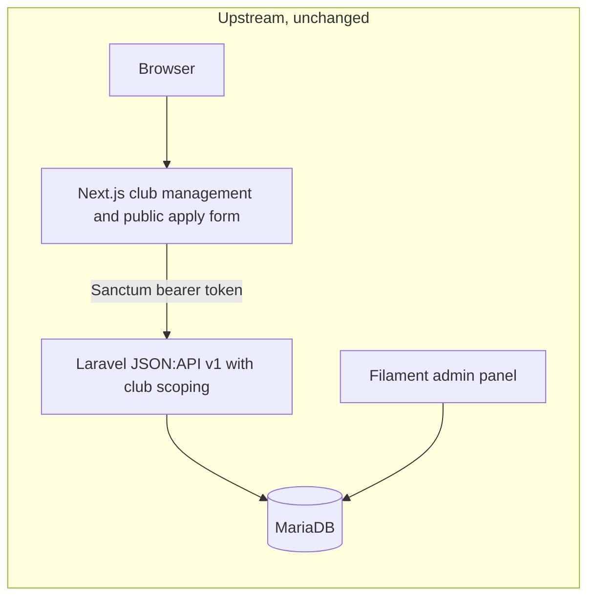
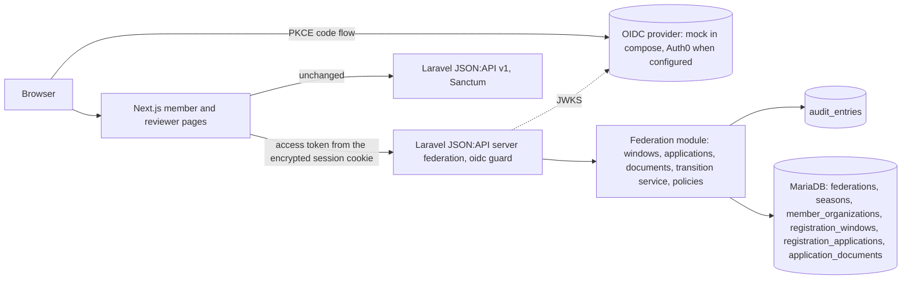
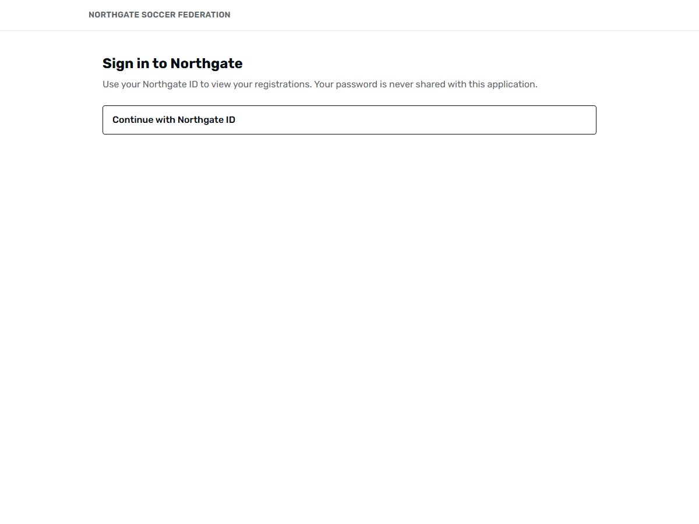
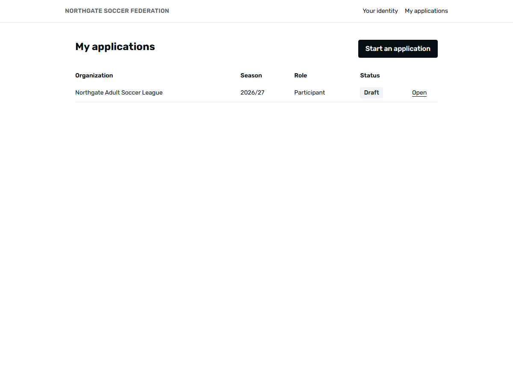
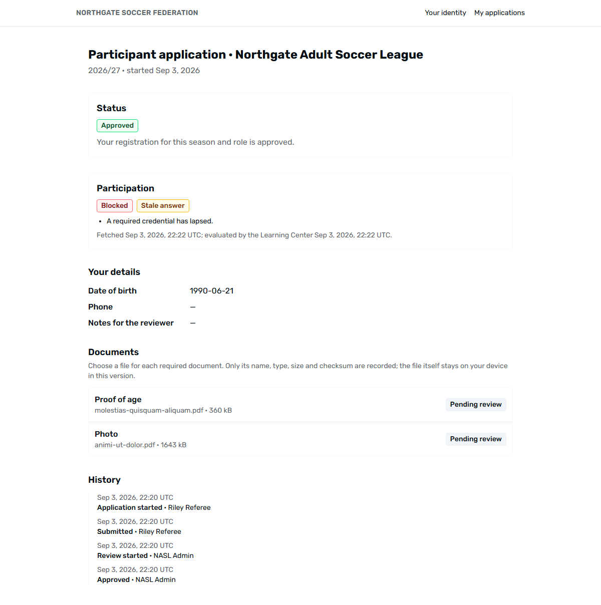
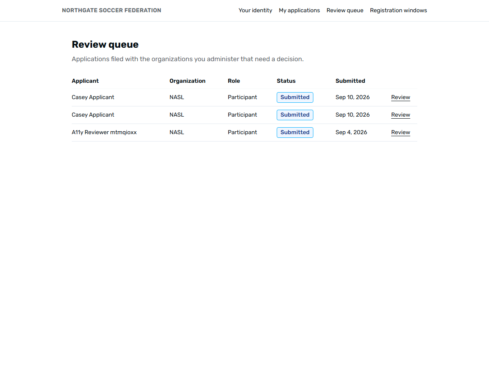

# Federation Member Services Lab

[](https://github.com/nick-bellows/federation-member-services-lab/actions/workflows/ci.yml)

An engineering modernization lab: an existing open-source club-management platform, extended step by step into a member-services system for a fictional national soccer federation, without a rewrite.

> **Fork notice.** This repository is a fork of [vereinfacht/vereinfacht](https://github.com/vereinfacht/vereinfacht) (MIT, © visuellverstehen GmbH). Upstream's history, license and attribution are preserved; upstream's own README is kept verbatim at [`docs/UPSTREAM_README.md`](docs/UPSTREAM_README.md). Everything the fork added is listed below and is visible with `git log upstream/main..main` and `git diff --stat upstream/main`.
>
> **Status: `validated` in CI, not deployed.** Everything described here runs in the local Docker Compose stack and in the CI workflow on GitHub (seven jobs on every push and pull request; badge above). Nothing is deployed and nothing here has users. The federation, its organizations and every person in the seed data are invented; this project is not affiliated with, endorsed by, or based on the internal systems of any real federation.

## The problem this fork works on

A national federation inherits a club-management platform that hundreds of clubs already use for membership applications, member records and club finances. The federation needs registration above the club level: organizations that group clubs, seasons, people who sign in with an identity the federation does not store passwords for, applications that move through review with reasons and an audit trail, and eligibility that is derived from facts rather than typed into a checkbox. A rewrite would break the clubs. The question the repository answers, milestone by milestone, is **how to add all of that to a running system without destabilizing what already works**.

The sibling project [learning-center-reference](https://github.com/nick-bellows/learning-center-reference) owns education, certification and safeguarding-derived eligibility. This repository owns organizations, membership, registration applications, document review and audit, and will consume credentials from the Learning Center over an HTTP contract only. The two never share a database.

## What the fork added, in order

| Milestone | What exists | Evidence |
|---|---|---|
| M0 Archaeology | The upstream system running unchanged, its request path traced end to end, its tests, gaps and MySQL-only SQL catalogued | [`docs/UPSTREAM_ANALYSIS.md`](docs/UPSTREAM_ANALYSIS.md), [`docs/baseline/`](docs/baseline/) |
| M1 Baseline quality | One behaviour fix with a fail-then-pass regression test (`env()` read under cached configuration returned the upstream production domain), line-ending safety, a CI workflow (draft), the test-tool decision | [ADR-0002](docs/adr/0002-runtime-settings-through-config-not-env.md), [`docs/baseline/env_bug_before_fix.txt`](docs/baseline/env_bug_before_fix.txt) |
| M2 Federation domain | Federation → member organization → club → member; a seven-state application lifecycle whose only writer is one transition service; an append-only audit trail; duplicate protection at two layers | [`docs/DOMAIN_MODEL.md`](docs/DOMAIN_MODEL.md), [ADR-0005](docs/adr/0005-federation-hierarchy-above-upstream-clubs.md), [ADR-0006](docs/adr/0006-application-state-machine-and-audit-trail.md) |
| M3 Identity | OpenID Connect sign-in (authorization code + PKCE) with the access token kept server-side; Laravel validates tokens against the issuer's keys and derives capabilities from the database, never from claims; a mock provider in compose, Auth0 when configured | [ADR-0007](docs/adr/0007-oidc-identity-boundary.md), [INCIDENT-000](docs/incidents/INCIDENT-000-dev-database-wiped-by-config-cache.md) |
| M4 Review slice | Registration windows, applications with details and document metadata, a second JSON:API server with generated TypeScript types, idempotent submission, correlation ids on every audit entry, member and reviewer pages, browser tests with accessibility scans | [ADR-0008](docs/adr/0008-document-metadata-without-file-storage.md), [INCIDENT-002](docs/incidents/INCIDENT-002-duplicate-submission.md), [`docs/assets/`](docs/assets/) |
| M5 Learning Center contract | A versioned credentials contract keyed by OIDC subject, executable as fixtures on both sides and served by a mock in Compose; the federation calls with its own client-credentials service token; participation derived on read from a stored snapshot with its age, refreshed after approval, on a reviewer's request and by reconciliation; Incident 1 rehearsed against a slowed provider | [`docs/contracts/learning-center-credentials-v1.md`](docs/contracts/learning-center-credentials-v1.md), [ADR-0009](docs/adr/0009-learning-center-credentials-contract.md), [INCIDENT-001](docs/incidents/INCIDENT-001-slow-credential-service.md), `docs/baseline/incident_001_2026-09-03.txt`, [learning-center-reference PR #1](https://github.com/nick-bellows/learning-center-reference/pull/1) |
| M6 Events and reliability | A transactional outbox written with every state change, a relay onto Laravel's database queue with one job per event and consumer, a processed-events ledger that makes at-least-once delivery act once, retries with backoff and a parked state an operator can read and replay; two consumers (notification rows, the credential refresh after approval); Incident 3 rehearsed (the worker fails after an approval); the broker mapping documented, none provisioned | [ADR-0010](docs/adr/0010-transactional-outbox-and-consumers.md), [INCIDENT-003](docs/incidents/INCIDENT-003-worker-fails-after-approval.md), `docs/baseline/incident_003_2026-09-03.txt` |
| M7 PostgreSQL | A three-engine compatibility matrix in CI (SQLite, MariaDB, PostgreSQL 16, the last one with the demo seeder); upstream's MySQL-only SQL made portable in place with a regression test (export ordering, a fee cast, a migration literal); engine differences recorded, none hidden; the driver in both images and an optional PostgreSQL service in Compose | [`docs/DATABASE_COMPATIBILITY.md`](docs/DATABASE_COMPATIBILITY.md), [ADR-0011](docs/adr/0011-postgresql-compatibility-matrix.md) |
| M8 Operability | JSON logs on stderr with request, user, trace and span ids and one access line per request; OpenTelemetry traces to a local Jaeger from the request through the outbox worker to the Learning Center call; liveness, readiness and metrics endpoints, and upstream's nine health checks routed; a runbook proved by re-running the three incidents against the signals | [`docs/OBSERVABILITY.md`](docs/OBSERVABILITY.md), [`docs/RUNBOOK.md`](docs/RUNBOOK.md), [ADR-0012](docs/adr/0012-observability.md), `docs/baseline/operability_2026-09-03.txt` |

Planned, not built: the accessibility and performance passes, release engineering. The order and gates are in [`ROADMAP.md`](ROADMAP.md).

## Architecture

**Inherited.** A Laravel 13 JSON:API backend with a Filament admin panel and Sanctum tokens, a Next.js 14 frontend, MariaDB, Docker Compose for development.



**Added.** A second JSON:API server for the federation, an OIDC identity boundary, the domain module, and a mock identity provider for development and CI. Upstream's paths are untouched; the two additive columns on upstream tables are nullable.



Decisions behind every box are recorded in [`docs/adr/`](docs/adr/).

## Five-minute path for a reviewer

| Minute | Open | What it shows |
|---|---|---|
| 0–1 | This page, then [`docs/UPSTREAM_ANALYSIS.md` §8](docs/UPSTREAM_ANALYSIS.md) | What was inherited, what was wrong with it, what the fork changed |
| 1–2 | The diagrams above, [`docs/DOMAIN_MODEL.md`](docs/DOMAIN_MODEL.md) | Identity, membership hierarchy, application lifecycle, audit |
| 2–3 | [`api/app/Federation/StateMachine/ApplicationTransitions.php`](api/app/Federation/StateMachine/ApplicationTransitions.php) and [`api/app/Federation/Actions/TransitionApplication.php`](api/app/Federation/Actions/TransitionApplication.php) | The one place status changes: legality, actor, reason, completeness, idempotency, audit, after-commit event |
| 3–4 | [`api/tests/Unit/Federation/ApplicationTransitionsTest.php`](api/tests/Unit/Federation/ApplicationTransitionsTest.php), [`api/tests/Feature/Federation/Http/RegistrationApplicationsHttpTest.php`](api/tests/Feature/Federation/Http/RegistrationApplicationsHttpTest.php), [`api/tests/Feature/Federation/OidcTokenVerifierTest.php`](api/tests/Feature/Federation/OidcTokenVerifierTest.php) | All 49 transition pairs pinned; authorization, idempotency and failure handling over HTTP; signature, issuer, audience, expiry, key rotation |
| 4–5 | [INCIDENT-000](docs/incidents/INCIDENT-000-dev-database-wiped-by-config-cache.md), [ADR-0007](docs/adr/0007-oidc-identity-boundary.md), [ADR-0004](docs/adr/0004-upstream-contribution-policy.md) | A real incident with a permanent fix; a boundary decision; what will be offered upstream and how |

## Screenshots

Captured from the running stack by [`e2e/tests/screenshots.spec.ts`](e2e/tests/screenshots.spec.ts); every name and file is synthetic.

| | |
|---|---|
|  |  |
|  |  |

## Running it locally

Requirements: Docker Desktop (or Docker Engine with Compose v2) and Node 20+ on the host only for the browser tests. No PHP is needed on the host; everything PHP runs in the `tooling` container, as upstream intends.

```sh
git clone --config core.autocrlf=false https://github.com/nick-bellows/federation-member-services-lab.git   # autocrlf off keeps the container scripts LF on Windows
cd federation-member-services-lab
git remote add upstream https://github.com/vereinfacht/vereinfacht.git && git fetch upstream   # only for the upstream-versus-fork diff above
cp docker-compose.override.example.yml docker-compose.override.yml   # Windows/NTFS: dependency trees in named volumes
printf 'USER_ID=1000\nGROUP_ID=1000\n' > .env
docker compose up -d --build database api api-docs oidc learning-center jaeger tooling
docker compose exec tooling bash
```

Inside the container:

```sh
cd api
composer install
cp .env.example .env && php artisan key:generate
sed -i 's/^MAIL_MAILER=smtp/MAIL_MAILER=log/' .env          # no mailpit service in compose
# The api container migrates the empty database on its own first start. Wait until
# `docker compose logs api` shows "Starting the app" (several minutes), then:
php artisan migrate:fresh --seeder=NorthgateDemoSeeder      # upstream's fake clubs + the Northgate federation
php artisan federation:reconcile-credentials --all         # credential snapshots from the Learning Center mock for approved applicants
php artisan filament:assets && npm ci && npm run build
cd ../web_application
cp .env.local.example .env.local
npm ci
WATCHPACK_POLLING=true npx next dev                          # polling: bind mounts on Windows deliver no file events
```

Then restart the API once so it loads the environment: `docker compose restart api`, and start the outbox relay and queue worker in the API container as its PHP-FPM user: `docker compose exec -d -u verein api php artisan federation:work` (ADR-0010; `php artisan federation:outbox-status` shows what it has done).

| Where | What |
|---|---|
| http://localhost:3000/en/member/sign-in | Member sign-in through the mock OIDC provider. Type any subject and a claims JSON such as `{"email":"alex.participant@northgate.example","email_verified":true,"name":"Alex Participant"}`. Seeded people: `alex.participant`, `sam.coach`, `riley.referee`, `jordan.newcomer`, `nysa-admin`, `nasl-admin`, `nra-admin`, `federation-admin`, all `@northgate.example`. Administrators see the review queue and the windows page. |
| http://localhost:3001/admin | Upstream's Filament panel, unchanged (`hello@vereinfacht.digital` / `password`) |
| http://localhost:3000/de/admin/auth/login | Upstream's club management, unchanged (`club-admin-1@example.org` / `password`; needs the super-admin token step from [`docs/UPSTREAM_README.md`](docs/UPSTREAM_README.md)) |
| http://localhost:3001/federation_openapi.json | The federation API contract |
| http://localhost:3004/default/.well-known/openid-configuration | The mock identity provider |
| http://localhost:3005/health | The Learning Center credentials mock; it serves the contract fixtures and takes `LEARNING_CENTER_MOCK_DELAY_MS` for the Incident 1 rehearsal |
| http://localhost:3006 | Jaeger: traces from the API, the outbox worker and the Learning Center call (service `federation-api`) |
| http://localhost:3001/api/health/ready, /api/metrics | Readiness with per-dependency detail; the federation's numbers in Prometheus text format ([`docs/OBSERVABILITY.md`](docs/OBSERVABILITY.md)) |

Every deviation from upstream's own instructions, and why, is in [`docs/UPSTREAM_ANALYSIS.md` §11](docs/UPSTREAM_ANALYSIS.md).

## Tests

```sh
docker compose exec tooling bash -lc 'cd api && php artisan test'          # 220 tests, SQLite in memory
cd e2e && npm ci && npx playwright install chromium && npx playwright test   # 7 browser journeys with axe, against the running stack
```

Measured on 2026-09-03 and retained under [`docs/baseline/`](docs/baseline/): PHPUnit 220 passed (961 assertions, `phpunit_after_b5_backend.txt`); Playwright 7 passed (`playwright_b5.txt`). The run instructions above were followed from a fresh clone in a separate Compose project on the same day (`docs/baseline/cold_clone_2026-09-02.txt`); the first run found a date that hydrated differently on the server and in the browser, which is fixed and now guarded by the browser spec. Upstream's baseline at the fork point was 91 tests and no frontend or end-to-end tests. [`.github/workflows/ci.yml`](.github/workflows/ci.yml) runs the PHP suite on SQLite, on MariaDB and on PostgreSQL 16 (with the demo seeder), Pint on the fork's own files, the frontend type-check, lint and build, the browser journeys, and publishes the upstream-versus-fork diff. It first ran on GitHub on 2026-09-03 (pull request #1); the first two runs failed on three things the local stack could not show, all fixed in the history and described in `docs/LEARNING_LOG.md`, and it has been green on every run since.

## Upstream contributions

None offered yet, by decision: the offer is made once, at the end of the project, when the fork has more to give than a two-line fix (roadmap decision 7). The policy is in [ADR-0004](docs/adr/0004-upstream-contribution-policy.md): one small, generic, tested change at a time, after reading the issue thread. First candidate: the `env()` fix together with `.gitattributes`, then the locale-header matching for upstream issue #125. Nothing here will be described as merged unless it is.

## Documentation

- [`ROADMAP.md`](ROADMAP.md): phases, gates, decisions taken, what is still open
- [`docs/UPSTREAM_ANALYSIS.md`](docs/UPSTREAM_ANALYSIS.md), [`docs/DATABASE_BASELINE.md`](docs/DATABASE_BASELINE.md): the inherited system as found
- [`docs/DOMAIN_MODEL.md`](docs/DOMAIN_MODEL.md): vocabulary, hierarchy, lifecycle, invariants
- [`docs/adr/`](docs/adr/): eight decision records
- [`docs/incidents/`](docs/incidents/): incident write-ups with detection, root cause, permanent fix and regression test
- [`docs/LEARNING_LOG.md`](docs/LEARNING_LOG.md): what was measured and what went wrong, per milestone
- [`docs/INTERVIEW_GUIDE.md`](docs/INTERVIEW_GUIDE.md): per area, what it does, why, alternatives, failure modes, code to open
- [`docs/future-work.md`](docs/future-work.md): the single home for deferred ideas

## How this was built

Independent open-source software engineering project. The work was done with AI pair-programming assistance (Claude Code) under a teaching protocol: every milestone opens with the relevant concepts, decisions are recorded as ADRs with alternatives, and every number in the documentation comes from a retained run. Failures are documented as they happened, including one that destroyed the development database.

## Attribution and license

Upstream: [vereinfacht](https://github.com/vereinfacht/vereinfacht), developed by [visuellverstehen](https://github.com/visuellverstehen), in part on behalf of the municipality of Süderbrarup. Distributed under the MIT license; see [`LICENSE`](LICENSE). Additions in this fork are contributed under the same license.
