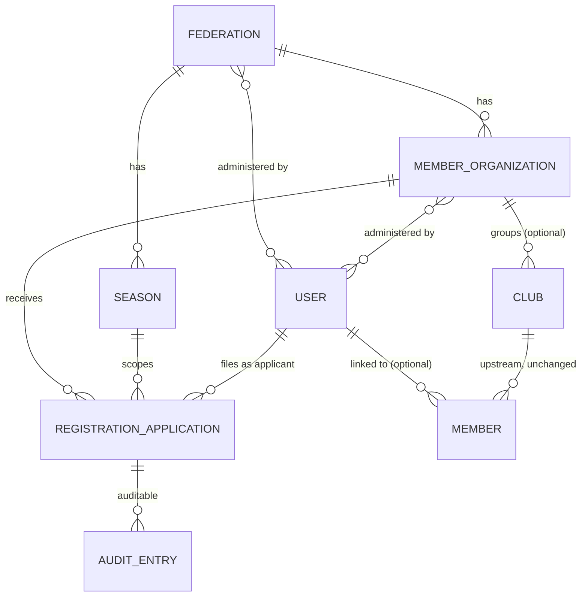
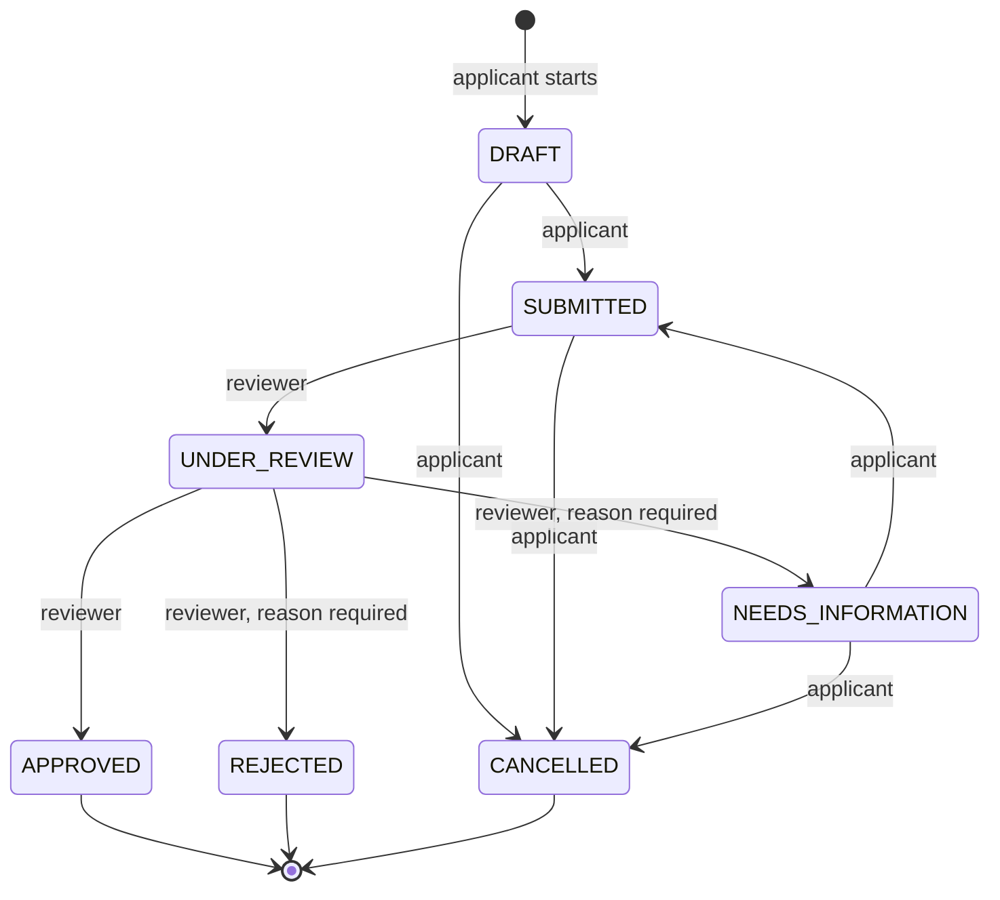

# Domain model

The federation layer added on top of upstream's club-management model in Milestone 2. Everything here is implemented under `api/app/Federation` and covered by `api/tests/Unit/Federation` and `api/tests/Feature/Federation`; nothing described here is planned-only unless it says so.

## Vocabulary

Upstream and the federation use the word *member* for two different things. This project keeps both and is explicit about which is meant.

| Term | Meaning here | Where it lives |
|---|---|---|
| **Federation** | The national body at the top of the hierarchy. Fictional: Northgate Soccer Federation (NSF). | `federations` |
| **Member organization** | A body that belongs to one federation and groups clubs: a youth association, an adult league, a referee association. Applications are filed with an organization. | `member_organizations` |
| **Club** | Upstream's club, unchanged. May belong to one member organization or to none. | `clubs` (+ nullable `member_organization_id`) |
| **Member** (upstream) | A person inside a club membership, created through the public apply form. Has no login. | `members` (+ nullable `user_id`) |
| **User** | A login principal. Upstream uses it for super admins and club admins; the federation uses it for everyone who signs in: applicants, organization administrators, federation administrators. | `users` |
| **Season** | A federation-scoped period that registrations belong to, e.g. `2026/27`. | `seasons` |
| **Registration application** | A user's request to be registered with a member organization for one role in one season. Has a lifecycle. | `registration_applications` |
| **Audit entry** | An immutable record of who did what to which resource, with the relevant state before and after. | `audit_entries` |

A *federation member* in the brief's sense is therefore a **user** with at least one approved registration application. There is no separate table for it; the fact is derived (see "Derived status" below).

## Hierarchy

Decisions behind the shape: `docs/adr/0005-federation-hierarchy-above-upstream-clubs.md` (additive keys, upstream tables untouched) and `docs/adr/0006-application-state-machine-and-audit-trail.md`.

## Roles

| Role | Kind | How it is held | What it may do (M2) |
|---|---|---|---|
| Participant, Coach, Referee | Member roles | Applied for: `registration_applications.role` | Become registered for a season once the application is approved |
| Organization administrator | Administrative | Row in `organization_administrators` | Review applications filed with that organization |
| Federation administrator | Administrative | Row in `federation_administrators` | Review applications filed with any organization of the federation |
| Club administrator, super admin | Upstream | spatie roles scoped to a club | Unchanged upstream rights; **not** reviewers of federation applications |

Administrative roles above the club cannot be expressed with upstream's spatie roles, whose team key is a club id; that is why they are explicit pivots. Authorization of a transition is answered by `App\Federation\Support\ApplicationActorResolver`: *applicant* means the user who filed the application; *reviewer* means an administrator of its organization or of the organization's federation.

## Application lifecycle

States: `DRAFT`, `SUBMITTED`, `UNDER_REVIEW`, `NEEDS_INFORMATION`, `APPROVED`, `REJECTED`, `CANCELLED`. The last three are terminal.

| From | To | Actor | Reason | Side effects |
|---|---|---|---|---|
| DRAFT | SUBMITTED | applicant | no | `submitted_at` set |
| DRAFT | CANCELLED | applicant | no | `cancelled_at` set; `active_key` cleared |
| SUBMITTED | UNDER_REVIEW | reviewer | no | |
| SUBMITTED | CANCELLED | applicant | no | `cancelled_at`; `active_key` cleared |
| UNDER_REVIEW | NEEDS_INFORMATION | reviewer | **yes** | `status_reason` stored |
| UNDER_REVIEW | APPROVED | reviewer | no | `decided_at` set |
| UNDER_REVIEW | REJECTED | reviewer | **yes** | `decided_at`; `status_reason`; `active_key` cleared |
| NEEDS_INFORMATION | SUBMITTED | applicant | no | `submitted_at` updated |
| NEEDS_INFORMATION | CANCELLED | applicant | no | `cancelled_at`; `active_key` cleared |

Every transition also writes one audit entry and, after the transaction commits, dispatches `ApplicationTransitioned`. The table above is executable: `api/app/Federation/StateMachine/ApplicationTransitions.php` is the source, `api/tests/Unit/Federation/ApplicationTransitionsTest.php` pins all 49 pairs.

**Invariants enforced in code**

- Status is written only by `TransitionApplication` through `RegistrationApplication::applyTransition()`; assigning it elsewhere throws. Controllers never see a status string they can set.
- The transition, the timestamps and the audit entry are one database transaction with the row locked; the event fires only after commit.
- One live application per applicant, organization, season and role: `active_key` is set while the status is open or approved and cleared when rejected or cancelled, and it carries a unique index. `StartApplication` checks first and raises `DuplicateApplicationException`; the unique index is the backstop under concurrency and its violation is translated to the same exception. A cancelled or rejected application therefore allows a new one, two live ones are impossible.
- `StartApplication` accepts an idempotency key: presenting the same key again returns the existing application instead of creating a second.
- A season must belong to the organization's federation.

## Audit entry

| Field | Content |
|---|---|
| `actor_user_id`, `actor_type` | Who: the user, or `system` when no user acted |
| `action` | `application.created`, `application.submitted`, … one per transition target |
| `auditable_type`, `auditable_id` | The resource |
| `previous_state`, `new_state` | The relevant state only, e.g. `{"status":"under_review"}` → `{"status":"approved"}`; never full rows, never secrets |
| `reason` | The reviewer's or applicant's reason when one was given |
| `request_id` | Correlation id of the HTTP request, when known (wired in the API milestone) |
| `occurred_at` | When |

Rows are append-only: the model throws on update and delete; the table has no `updated_at`.

## Derived status (M5 / B2)

Whether a person may participate is **not** a column. It is computed on read (`ParticipationResolver`) from three inputs: the application's status (approved or not), the provider's `eligibility.status` in the applicant's stored credential snapshot, and, for coach and referee applications, a valid role credential in that snapshot. The result is the `participation` attribute of a registration application: `may_participate`, `blocked` or `unknown`, with every reason listed (`not_approved`, `no_snapshot`, `no_learning_center_record`, `hold_active`, `credential_lapsed`, `role_credential_missing`), the provider's `as_of`, this side's `fetched_at`, and a `stale` marker when the snapshot is older than the configured limit. No editable "eligible" flag exists anywhere in the schema.

| Entity | Meaning | Rules |
|---|---|---|
| **Credential snapshot** (`credential_snapshots`) | The last answer of the Learning Center credentials contract for one user: the payload verbatim, the provider's `as_of`, this side's `fetched_at`, and the provider's eligibility status or `not_found`. | One row per user; written only by `CredentialSnapshots::refresh` after an approval, on a reviewer's `refresh-credentials` action, or by `federation:reconcile-credentials`. A change of eligibility status is audited on the user as `credentials.changed`; the first record as `credentials.recorded`. Reads never call the provider (ADR-0009). |

## Registration windows and documents (M4)

| Entity | Meaning | Rules |
|---|---|---|
| **Registration window** (`registration_windows`) | An organization administrator opens registration for one season and a set of roles, with `opens_at` and `closes_at`. One window per organization and season. | Applications can only be started inside an open window and only for roles it offers (`StartApplication`). Created over the API by an administrator of that organization or its federation; audited as `window.opened`. |
| **Application details** | `date_of_birth`, `phone`, `applicant_notes` on the application. | Editable by the applicant while the application is `DRAFT` or `NEEDS_INFORMATION`; every change is audited as `application.details_updated`. Role and window are fixed once started. |
| **Application document** (`application_documents`) | Metadata about one document: type, file name, MIME type, size, SHA-256 checksum, review status, reviewer note. No bytes are stored (ADR-0008). | One per type per application (unique). Attached by the applicant while editable; replacing resets the review to `pending`. Reviewed (`accepted` / `rejected` with a note) by a reviewer while the application is `UNDER_REVIEW`. |
| **Required documents** | `DocumentType::requiredFor(role)`: participant needs proof of age and photo; coach adds coaching licence and background-check consent; referee adds referee certificate and background-check consent. | Submission is refused with a 422 listing what is missing until every required type has metadata and a date of birth is present. |

Over HTTP the same rules appear as stable error codes: `window_closed`, `role_not_offered`, `duplicate_application`, `application_incomplete` (with `meta.missingDocuments`), `application_not_editable`, `illegal_transition`, `transition_not_allowed_for_actor`, `reason_required`, `document_not_allowed`.

## Deliberately not modelled

- Teams, matches, competitions, transfers: out of scope for a member-services lab.
- Documents: metadata and review arrive with the registration-review slice (A4), backed by synthetic files only.
- Registration windows and fees: the roadmap's review slice opens a window per organization and season; the data model for it is added when the workflow needs it.
- A federation-level "member" table: derived from approved applications instead (see above).
